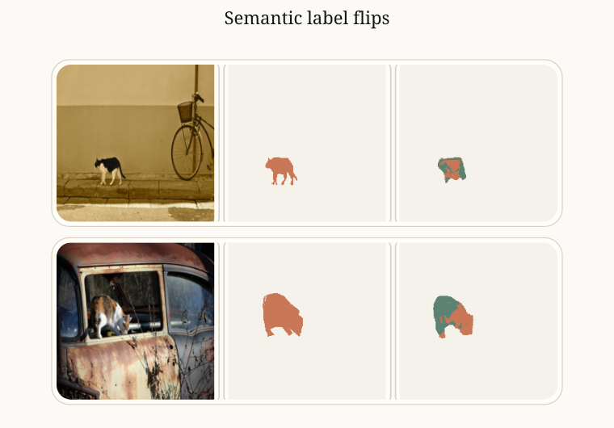
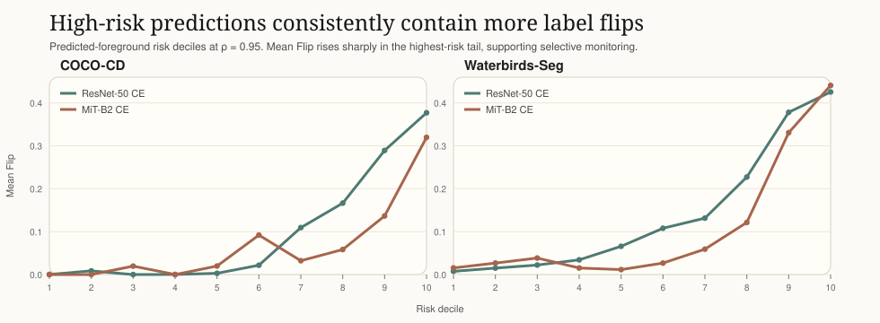

# Right Regions, Wrong Labels

Semantic label flips in segmentation under correlation shift.

Code for the paper `Right Regions, Wrong Labels: Semantic Label Flips in Segmentation under Correlation Shift`.

<p align="center">
  
  
</p>

High predicted foreground risk consistently surfaces examples with semantic label flips, which makes it useful for lightweight monitoring without ground-truth labels.

## Overview

This repository contains:
- dataset generation for `Waterbirds-Seg` and `COCO-CD`
- training code for segmentation models under correlation shift
- evaluation code for IoU, foreground error decomposition, and flip-risk diagnostics
- shared `COCO-CD` annotations and checkpoints

## Install

```bash
pip install -e .
```

## Datasets

The paper studies two foreground segmentation settings with two confusable foreground classes and one shared background class:
- `Waterbirds-Seg`: a segmentation adaptation of Waterbirds with land/water scene context
- `COCO-CD`: a cat vs dog setting from COCO with coarse indoor/outdoor context derived from COCO-Stuff

You can download the CUB, Places365, and COCO/COCO-Stuff archives with:

```bash
./scripts/download_datasets.sh /path/to/raw_data
```

### Waterbirds-Seg

Download and extract `CUB_200_2011` and `Places365`, then pass those roots as `--cub-dir` and `--places-dir`.

The generator expects:
- CUB under `/path/to/CUB_200_2011`
- Places images under the extracted Places root, such as `/path/to/places365_standard`

Supported Waterbirds-Seg correlations in this repo are `0.5` and `0.95`.

It writes a derived segmentation dataset to `/path/to/output/correlation_0.95`, including `images/`, `masks/`, and `images/metadata.csv`.

Generate:

```bash
./scripts/generate_datasets.sh \
  waterbirds_seg \
  --cub-dir /path/to/CUB_200_2011 \
  --places-dir /path/to/places365_standard \
  --output-dir /path/to/output \
  --correlation 0.95
```

### COCO-CD

Download and extract MS COCO 2017 images and annotations, plus COCO-Stuff annotations for the same splits.

The generator expects:
- `--coco-root` pointing at the COCO directory containing `train2017/`, `val2017/`, and `annotations/instances_*.json`
- `--stuff-annotations-dir` pointing at the directory containing `stuff_train2017.json` and `stuff_val2017.json`

Generate:

```bash
./scripts/generate_datasets.sh \
  coco_cd \
  --coco-root /path/to/coco \
  --stuff-annotations-dir /path/to/coco_stuff/annotations \
  --output-dir /path/to/output/coco_cd \
  --train-correlation 0.95
```

## Training

Train `Waterbirds-Seg`:

```bash
./scripts/train.sh \
  --dataset waterbirds_seg \
  --data_root /path/to/output/correlation_0.95 \
  --model-name resnet \
  --kind CE \
  --output-dir /path/to/checkpoints
```

Train `COCO-CD`:

```bash
./scripts/train.sh \
  --dataset coco_cd \
  --coco-root /path/to/coco \
  --model-name resnet \
  --kind CE \
  --output-dir /path/to/checkpoints
```

## Evaluation

Evaluate `Waterbirds-Seg`:

```bash
./scripts/test.sh \
  --dataset waterbirds_seg \
  --data_root /path/to/output/correlation_0.95 \
  --checkpoint /path/to/checkpoints/best_model_resnet_ce.pt
```

Evaluate `COCO-CD`:

```bash
./scripts/test.sh \
  --dataset coco_cd \
  --coco-root /path/to/coco \
  --model-name resnet \
  --checkpoint /path/to/checkpoints/best_model_resnet_ce.pt
```

Evaluation reports:
- class-wise IoU
- binary foreground IoU
- class-specific subgroup IoU gaps
- foreground error decomposition (`FG-Corr`, `FG-Flip`, `FG-Miss`)
- predicted-foreground flip-risk deciles and top-decile flip share

## Provided Files

This repo includes:
- `COCO-CD` annotation JSONs in `annotations/coco_cd/`
- checkpoints in `checkpoints/`

The bundled checkpoints are tracked with Git LFS. Make sure Git LFS is enabled when cloning this repo.
